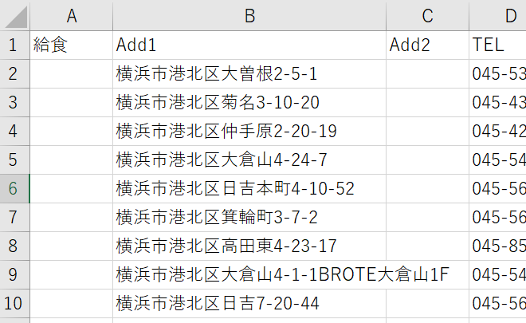
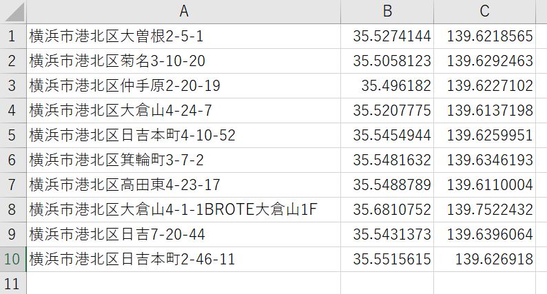

# fetch_coordinates_tool

自動でWebブラウザを操作してGoogle Mapsにアクセスして住所から座標を取得するツール 
主な用途は以下の２つ 
1. csvファイルの住所一覧を読み込み、csvファイルに座標一覧を出力
2. 座標の妥当性チェックのGoogleMaps上の目視確認のための画面遷移の自動化
 

用途1のイメージ 

`ツールが読み取る住所一覧のcsv` 

`ツールが出力する座標一覧のcsv` 

## 要件
- Webブラウザのドライバー  ※現在はGoogle Chromeのみ対応 
  ChromeDriver https://sites.google.com/a/chromium.org/chromedriver/downloads 
  ※macであればbrew install chromedriverなどで可能と思われる
- python3系
- requirements.txtで定義されたpythonモジュール 
    `$ pip(またはpip3) install -t requirements.txt`

## 準備
1. 住所一覧のcsvファイルを準備 
※csvの住所が記載された列のタイトル(先頭行)は「Add1」であること。

2. ツールの環境設定 settings.pyの更新 
   Webブラウザのドライバーを配置した環境(PC)のフォルダパスなど必要に応じて更新する 
   各設定値の詳細はsettings.pyを参照お願い。

## 実行
    1. 実行環境のターミナルを開く e.g Windowsならコマンドプロンプトなど

    2. コマンドを引数に住所一覧csvファイルのパスを指定して実行
        (例) `$ python3 .\fetch_coord_by_browser.py -a 住所一覧のcsvファイルのパス`

        Webブラウザを指定(省略時はchrome)する場合は以下のように-b ブラウザ名を指定する
        (例) `$ python3 -b chrome .\fetch_coord_by_browser.py -a 住所一覧のcsvファイルのパス`

        ヘルプの表示 `$ python3 .\fetch_coord_by_browser.py -h`

    3. ブラウザの確認  ※目視確認(VISUAL_CHECK=True)の場合
        自動でGoogle Maps上で住所検索されたポイントが問題ないか確認
        問題なければ、該当のブラウザタブを閉じる(Ctrl + wやタブの閉じるボタン)
        タブはMAX_TAB_SIZEまで自動起動され、既存のタブが閉じられるまで待ち受けとなる

    4. 座標一覧のファイルが住所一覧csvファイルと同じパスで以下のフォーマットで出力される
        (例) 住所一覧csvファイル_yyyyMMddhhmmss.csv

## 注意点
    1. 数件座標の取得に失敗する場合がある
        ※特に並行数をCPUコア数に対してオーバーコミットした場合など
    2. 実行環境の性能に合わない、並行数を指定した場合など、処理が停止する場合がある。
    　 その場合、Webブラウザとドライバーのプロセスが正常終了されずに残る可能性があるので、
    　 タスクマネージャ、アクティビティモニタなどから確認して終了させること。